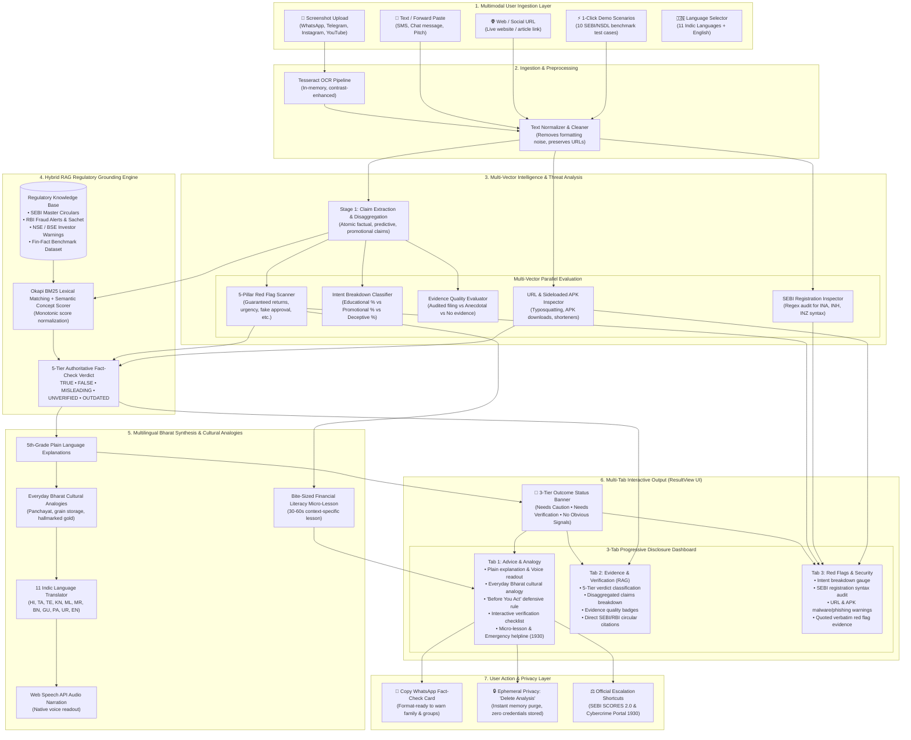

# Nambikkai (நம்பிக்கை) — Track E MVP

> **Understand before you trust.**  
> *Nambikkai helps Indian retail investors understand, fact-check, and verify financial content they encounter online—before they trust, share, or act on it.*

**Primary Hackathon Track:** Track E — Misinformation & Content Literacy  
**Organized by:** SEBI, NSDL, and IIT BHU (SANGYAN Hackathon 2026)

---

## Complete End-to-End System Workflow: User to Output

Nambikkai processes unverified financial content through an end-to-end multi-stage pipeline—from raw multimodal user ingestion to an evidence-grounded, multilingual decision dashboard.



---

## Detailed Step-by-Step Breakdown: From Input to Output

### Step 1: User Ingestion (Multimodal Inputs)
Users can submit financial content through four flexible entry points:
- **Screenshot / Image Upload**: Upload screenshots of WhatsApp forwards, Telegram tip channels, Instagram influencer reels, or promotional social media ads.
- **Raw Text / SMS Paste**: Paste copied SMS messages, chat messages, or investment pitches directly into the input area.
- **Live URL Inspection**: Enter any web link; the backend securely fetches the page content while preventing SSRF vulnerabilities.
- **1-Click Demo Scenarios**: Instant access to 10 curated benchmark scenarios (covering ponzi schemes, fake SEBI registrations, unauthorized Telegram VIP groups, deepfakes, and compliant educational posts).
- **Indic Language Selection**: Choose between 11 languages (English, Hindi, Tamil, Telugu, Kannada, Malayalam, Marathi, Bengali, Gujarati, Odia, Urdu) at any stage.

### Step 2: Ingestion & Text Preprocessing
- **In-Memory OCR Extraction**: Images are ingested into memory (never saved to disk for user privacy) and passed to Tesseract OCR with contrast enhancement and grayscale conversion.
- **Text Normalization**: Strips excessive whitespace and Unicode control characters while strictly preserving URLs, phone numbers, UPI IDs, and percentage signs for downstream security inspection.

### Step 3: Multi-Vector Threat & Misinformation Analysis
The core analysis engine executes multi-vector evaluation in parallel:
1. **Claim Extraction & Disaggregation**: Breaks down complex compound messages into individual atomic claims, tagging each claim as *factual*, *predictive*, *promotional*, or *opinion*.
2. **5-Pillar Red Flag Taxonomy Scan**: Evaluates claims against a 5-pillar taxonomy with mandatory quoted verbatim evidence:
   - **Financial Claims**: Guaranteed returns, fixed high return, zero-risk claims, doubling schemes.
   - **Psychological Manipulation**: Artificial urgency, VIP slot scarcity, FOMO, emotional guilt.
   - **Authority & Legitimacy**: Fake SEBI/RBI endorsement, government impersonation, celebrity deepfakes.
   - **Evidence Problems**: Missing audited sources, fabricated statistics, cherry-picked backtests.
   - **Direct Fraud Indicators**: Upfront activation fees, personal UPI IDs (`@okhdfc`), unmonitored Telegram links.
3. **Intent Breakdown Classifier**: Analyzes linguistic intent and outputs percentage shares:
   $$\text{Intent Score} = \text{Educational \%} + \text{Promotional \%} + \text{Deceptive \%} = 100\%$$
   Flags commercial solicitation (e.g. asking users to DM for paid courses or paid tip groups).
4. **Evidence Quality Inspector**: Assigns an evidence badge to each claim:
   - `audited_filing`: Backed by verifiable exchange filings or corporate disclosures.
   - `anecdotal_cherrypicked`: Single screenshots of trading P&L without audited broker ledger proof.
   - `no_evidence`: Pure assertion without supporting data.
5. **SEBI Registration Inspector**: Scans for claimed intermediary registration numbers using strict regex patterns (`INA` for Investment Advisers, `INH` for Research Analysts, `INZ` for Stock Brokers) and provides direct links to search SEBI's official intermediary directory.
6. **URL & Sideloaded APK Security Inspector**: 
   - Detects direct links to `.apk`, `.dmg`, or `.exe` files attempting to bypass official app stores.
   - Flags typosquatting of regulatory domains (e.g., `sebi-*.in`, `nse-*.top`, `rbi123.vip`).
   - Identifies URL shorteners (`bit.ly`, `tinyurl`, `wa.me`, `t.me`) used to conceal malicious destinations.

### Step 4: Hybrid RAG Regulatory Grounding Engine
Rather than relying on ungrounded AI generation, Nambikkai uses an offline-first **Hybrid Retrieval-Augmented Generation (RAG)** engine:
- **Indexed Regulatory Knowledge Base**: Curated corpus of official SEBI Master Circulars, RBI Fraud Advisories & Sachet directives, NSE/BSE Caution Notices, and Fin-Fact benchmark datasets.
- **Retrieval Engine**: Combines Okapi BM25 lexical token matching with semantic concept scoring, normalized using a monotonic calibration function:
  $$\text{Calibrated Score} = \frac{\text{BM25 Score}}{\text{BM25 Score} + 2.5}$$
- **5-Tier Fact-Checking Verdict**:
  - `TRUE`: Statutory regulatory disclosures, authentic disclaimers, or verified facts.
  - `FALSE`: Refuted directly by SEBI/RBI regulations (e.g., guaranteed stock market returns, FPI sub-accounts for retail).
  - `MISLEADING`: Distorted half-truths, omitting downside market risk, or framing past returns as guarantees.
  - `UNVERIFIED`: Epistemic honesty for arbitrary private claims without verified public filings (avoids false certainty).
  - `OUTDATED`: Defunct rules or lapsed tax schemes (e.g., RGESS 80CCG).

### Step 5: Multilingual Bharat Synthesis & Cultural Analogies
- **5th-Grade Plain Language**: Eliminates Wall Street and Dalal Street jargon into clear, everyday language.
- **Everyday Bharat Cultural Analogies**: Contextualizes financial traps through everyday Indian metaphors (e.g., explaining Ponzi schemes using a village grain storage or unregistered chit fund analogy).
- **Multilingual Support (11 Languages)**: Comprehensive translations across Hindi, Tamil, Telugu, Kannada, Malayalam, Marathi, Bengali, Gujarati, Odia, Urdu, and English.
- **Web Speech API Audio Narration**: In-browser text-to-speech with natural regional pacing for low-literacy or visually impaired investors.
- **Targeted Micro-Lesson**: Contextual 30-60 second bite-sized financial literacy lesson tied directly to the highest-severity red flag detected.

### Step 6: User Output (ResultView UI)
The user is presented with a structured, actionable dashboard:
- **3-Tier Outcome Status Banner**:
  - 🚨 **Needs Caution** (`potentially_misleading`): High-severity red flags detected (guaranteed returns, payment requests, fake regulatory claims).
  - ⚠️ **Needs Verification** (`needs_verification`): Important claims exist, but independent regulatory verification is required before trusting.
  - ✅ **No Obvious Warning Signals Detected** (`no_obvious_signals`): Educational, balanced, or compliant content with proper risk disclosures.
- **3-Tab Progressive Disclosure Dashboard**:
  - **Tab 1: Advice & Analogy**: Overall verdict, Audio Readout, Everyday Bharat Analogy, Multilingual Explanation, "Before You Act" rule, interactive 3-step verification checklist, and micro-lesson.
  - **Tab 2: Evidence & Verification (RAG)**: 5-Tier verdict breakdown, Claim-by-Claim verification table with evidence quality badges, and direct retrieved excerpts from official SEBI/RBI/NSE circulars.
  - **Tab 3: Red Flags & Security**: Visual Intent Breakdown gauge, SEBI registration syntax audit card, URL & APK malware/phishing warnings, and 5-Pillar Warning Signal cards with exact quoted text evidence.

### Step 7: User Action & Privacy Layer
- **WhatsApp Fact-Check Card**: 1-click button generates a pre-formatted, emoji-structured summary that users can immediately paste into WhatsApp or Telegram groups to protect family members.
- **Emergency Action Shortcuts**: Direct links to SEBI SCORES 2.0 for lodging formal regulatory complaints and the National Cybercrime Reporting Portal (`1930` / `cybercrime.gov.in`) for urgent financial freeze requests.
- **Privacy-First "Delete Analysis"**: All user uploads and analyses are held in ephemeral in-memory cache. Clicking "Delete Analysis" immediately purges all trace of the query from memory.

---

## Key Design Principles

- **Defensible Classifications**: Nambikkai never asserts *"This is 100% a scam"*. Instead, it classifies content into three clear, defensible outcomes:
  - 🚨 **Needs Caution** (`potentially_misleading`): High-severity warning signals detected.
  - ⚠️ **Needs Verification** (`needs_verification`): Claims require independent regulatory verification.
  - ✅ **No Obvious Warning Signals Detected** (`no_obvious_signals`): Compliant or educational content with disclosures.
- **Epistemic Honesty**: Unknown private claims are classified as `UNVERIFIED` rather than hallucinating certainty.
- **Evidence-First**: Every warning flag requires direct, quoted text evidence from the input.
- **Privacy-First**: Zero passwords, OTPs, Demat credentials, or bank details are ever requested or stored. Uploaded screenshots are processed in-memory and an instant *"Delete Analysis"* feature is provided.
- **Zero Investment Advice**: Nambikkai does not recommend stocks, buy/sell calls, or portfolios.

---

## 5-Pillar Red Flag Taxonomy

1. **Financial Claims**: Guaranteed returns, fixed high return, zero-risk claim, unrealistic returns, future price target, doubling schemes.
2. **Psychological Manipulation**: Urgency, scarcity (VIP slots), FOMO, pressure, emotional appeal.
3. **Authority & Legitimacy**: Fake regulatory approval (SEBI/RBI), government impersonation, celebrity deepfake/endorsement, unregistered advisor.
4. **Evidence Problems**: Missing sources, unsupported statistics (99.8% win rate), historical performance as safety proof, cherry-picked results.
5. **Direct Fraud Indicators**: Upfront fees, personal UPI IDs, credential/OTP requests, unmonitored Telegram redirects.

---

## Quickstart

### Prerequisites
- Python 3.11+
- Node.js v18+ and npm
- Tesseract OCR (installed and available on PATH for image OCR)

### 1. Backend Setup

```powershell
cd backend

# Activate virtual environment
.venv\Scripts\activate

# Run automated tests (43 comprehensive tests covering all modules)
pytest -v

# Start FastAPI server
uvicorn app.main:app --port 8000 --reload
```

*Backend runs at `http://127.0.0.1:8000` with interactive OpenAPI docs at `http://127.0.0.1:8000/docs`.*

### 2. Frontend Setup

```powershell
cd frontend

# Install dependencies
npm install

# Run type check and production build
npm run build

# Start Vite development server
npm run dev
```

*Frontend runs at `http://localhost:5173` with automated API proxy to the backend.*

---

## 3 Flagship Presentation Demo Scenarios

In the UI, click any of the 3 top demo buttons for instant 1-click loading:

1. **Demo 1 — Obvious Fraud**:
   > *"Guaranteed 40% monthly returns. Pay ₹5,000 today to activate your account. Limited slots available. Join VIP channel now!"*  
   **Result:** 🚨 **Needs Caution** (`FALSE` verdict) with Guaranteed Returns, Upfront Payment, Artificial Urgency, and Scarcity flags.

2. **Demo 2 — Misleading Past Performance**:
   > *"This fund delivered 25% last year, proving it is one of the safest investments with zero market risk."*  
   **Result:** ⚠️ **Needs Verification** (`MISLEADING` verdict) with Missing Risk Context and Zero Risk claim flags.

3. **Demo 3 — Educational Disclaimer**:
   > *"A mutual fund's past performance does not guarantee future results. Mutual fund investments are subject to market risks, read all scheme related documents carefully before investing."*  
   **Result:** ✅ **No Obvious Warning Signals Detected** (`TRUE` statutory disclosure).

---

## Project Structure

```text
Sangyan_Hackathon/
├── backend/
│   ├── app/
│   │   ├── classifier.py      # Intent breakdown classifier & SEBI registration inspector
│   │   ├── analyzer.py        # Central intelligence engine (Gemini API + heuristic fallback)
│   │   ├── demo_data.py       # 10 benchmark test cases and demo presentation data
│   │   ├── lessons.py         # Financial literacy micro-lessons database
│   │   ├── main.py            # FastAPI REST API endpoints
│   │   ├── multilingual.py    # Indic language translation synthesis & cultural analogies
│   │   ├── ocr.py             # Tesseract OCR & image preprocessing pipeline
│   │   ├── prompts.py         # 3-stage prompts (Extraction, Signals, Explanation)
│   │   ├── schemas.py         # Pydantic v2 data models & 5-tier taxonomy contracts
│   │   ├── taxonomy.py        # 5-pillar red flag and manipulation taxonomy
│   │   ├── url_inspector.py   # URL & sideloaded APK security inspector
│   │   ├── datasets/
│   │   │   └── sebi_nsdl_advisories.py # Official SEBI/NSDL advisories & scam modus operandi
│   │   └── rag/
│   │       ├── store.py       # Regulatory knowledge base (SEBI, RBI, NSE, BSE circulars)
│   │       └── retriever.py   # BM25 + semantic concept Hybrid RAG retrieval engine
│   ├── tests/
│   │   ├── conftest.py        # Test fixtures
│   │   ├── test_analyzer.py   # Benchmark test suite for the 10 test cases
│   │   ├── test_api.py        # Integration tests for FastAPI endpoints
│   │   ├── test_rag.py        # RAG retrieval and 5-tier verdict tests
│   │   └── test_url_inspector.py # URL/APK inspection and typosquatting tests
│   ├── requirements.txt       # Python dependencies
│   └── pytest.ini             # Pytest configuration
├── frontend/
│   ├── src/
│   │   ├── components/
│   │   │   ├── AnalyzingOverlay.tsx    # Animated 4-step progress screen
│   │   │   ├── DemoBar.tsx             # 1-click presentation demo bar
│   │   │   ├── DemoPage.tsx            # 10 interactive benchmark scenarios page
│   │   │   ├── Header.tsx              # Brand, 11 Indic languages selector, privacy badge
│   │   │   ├── InputSection.tsx        # Screenshot upload, text paste, and URL tabs
│   │   │   ├── LessonsPage.tsx         # Financial literacy micro-lessons gallery
│   │   │   ├── RegulatoryWatchPage.tsx # Official SEBI/NSDL circulars & scam alert database
│   │   │   └── ResultView.tsx          # 3-tab progressive disclosure result dashboard
│   │   ├── i18n/
│   │   │   ├── languages.ts            # 11 Indic language configurations & speech codes
│   │   │   └── translations.ts         # Full UI translations for all supported languages
│   │   ├── api.ts             # Frontend API client
│   │   ├── types.ts           # TypeScript data contracts & 5-tier taxonomy interfaces
│   │   ├── App.tsx            # Main application coordinator
│   │   └── index.css          # Tailwind directives & Poppins font styling
│   ├── package.json
│   ├── tailwind.config.js
│   └── vite.config.ts
├── SANGYAN-Problem-Statement.pdf # Official SANGYAN Hackathon Track E problem statement
├── SESSION_STATE.md             # Active project state & roadmap checkpoint
└── README.md                    # Project documentation & full end-to-end workflow
```
